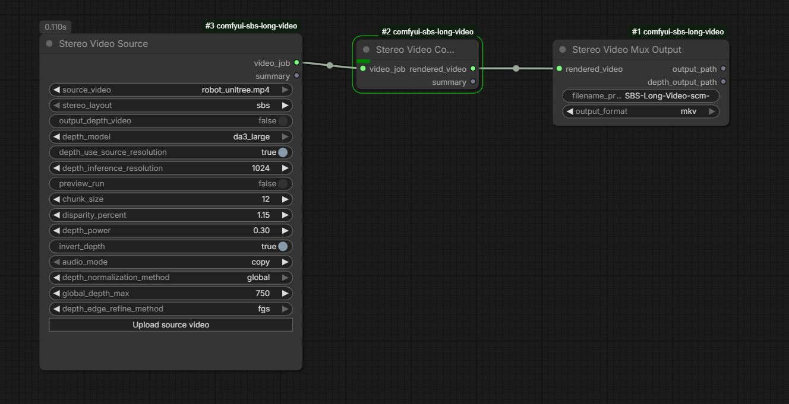

# ComfyUI Stereo Long Video

`ComfyUI Stereo Long Video` is a video-first custom node package for converting flat video into 3D stereoscopic output inside ComfyUI. Using the Depth Anything 3 AI model for depth estimation on a monocular input video. Resulting in a SBS or top/bottom stereo video that can be used on 3D displays. 

Instead of pushing long clips through image-batch workflows, this project treats video as a stream:

- `ffmpeg` decodes frames in chunks
- depth is estimated once per chunk with a long-lived runner
- stereo reprojection happens on the GPU with `torch.grid_sample`
- frames are streamed into an encoder instead of being kept in RAM
- source audio can be muxed back into the final file



## Purpose

This project is meant for long-form stereo video generation in ComfyUI, especially where clip length, VRAM, and encode time make image-oriented nodes impractical.

The repo currently ships three nodes:

- `StereoVideoSource`
- `StereoVideoConvert`
- `StereoVideoMuxOutput`

## Why This Exists

Most 2D-to-3D video workflows either process video as large image batches or rely on video-native depth models that can require substantial VRAM, especially at higher resolutions.

This project targets a different use case: a memory-efficient SBS video converter for ComfyUI that can still run on low VRAM and RAM machines. It decodes video in chunks, runs per-frame depth estimation with Depth Anything, renders stereo on the GPU, and streams frames into the encoder instead of keeping the whole clip in memory.

That design involves a tradeoff. Video-oriented depth models can deliver stronger temporal consistency, but they often demand more VRAM for higher-resolution inputs. This project instead prioritizes practical long-video conversion on modest hardware while still producing useful depth estimation and stereo output for higher-resolution material.

A central goal was to implement GPU-based image processing for the heavy lifting so that conversion runs many times faster than CPU-bound alternatives. In practice, the pipeline works like this: **FFmpeg** decodes the source video in configurable chunks and feeds raw frames into the pipeline. Each chunk is moved to the GPU once; **Depth Anything** runs depth inference there. The **stereo reprojection** step then runs entirely on the GPU: depth is turned into per-pixel disparity, and left/right views are generated with `torch.grid_sample` (bilinear sampling). Hole-filling for disoccluded regions uses GPU `avg_pool2d` iterations. The resulting stereo frames are streamed straight into an **ffmpeg** encoder process via a pipe, so only one chunk lives in memory at a time. By keeping decode → depth → render → encode in a single streaming loop and doing all per-frame image work on the GPU, the converter avoids CPU-bound warping.

## Installation

Clone the repo into your ComfyUI `custom_nodes` directory:

```bash
cd /path/to/ComfyUI/custom_nodes
git clone https://github.com/oskar13/comfyui-sbs-long-video.git
```

Install the Python dependencies into the same environment that runs ComfyUI:

```bash
cd /path/to/ComfyUI
python -m pip install -r custom_nodes/comfyui-sbs-long-video/requirements.txt
```

System requirements:

- `ffmpeg` and `ffprobe` must be available on `PATH`
- `torch` must be installed in the ComfyUI environment
- a CUDA-capable GPU is strongly recommended for practical runtime

Optional depth backend:

- if the official Depth Anything 3 package is available, install it in the ComfyUI environment:

```bash
python -m pip install git+https://github.com/ByteDance-Seed/Depth-Anything-3.git
```

- otherwise the plugin falls back to `transformers`-compatible checkpoints

After installing dependencies, restart ComfyUI.

## Workflow

1. Add `Stereo Video Source` and choose a source clip from ComfyUI's input directory.
2. Leave `use_depth_video` off to estimate depth automatically using the Depth Anything 3 model, or enable it and select a matching depth video.
3. Send the job into `Stereo Video Convert` to run decode, depth, stereo rendering, and temporary video encode.
4. Optionally enable `output_depth_video` to save generated depth as a lossless 8-bit grayscale FFV1/MKV file. This is allowed for sources shorter than 60 seconds, or when `preview_run` is enabled. Finish with `Stereo Video Mux Output` to save the final file into ComfyUI's output directory.

## How Files Are Produced

This plugin works with ComfyUI's standard directories:

- Source clips are read from the ComfyUI input directory.
- Optional external depth videos are also selected from the input directory.
- `StereoVideoConvert` writes a temporary rendered video into the ComfyUI temp directory.
- `StereoVideoMuxOutput` writes the final video into the ComfyUI output directory. When requested, it also writes the generated depth video there as `<prefix>_depth_00001.mkv` (auto-incremented).

Final filenames are auto-incremented:

- `prefix_00001.mp4`
- `prefix_00002.mp4`
- `prefix_00001.webm`
- `prefix_00001.mkv`

Available final container choices:

- `mp4`
- `webm`
- `mkv`

Audio behavior:

- `audio_mode = copy` trims and muxes audio from the original source clip
- `audio_mode = none` writes a video-only file

Preview and batch behavior:

- `preview_run` processes every 30th frame for a quick preview; disabled processes every frame
- `chunk_size` controls how many frames are processed at once
- `filename_prefix` controls the base name of each final export

## Depth Modes

Current depth sources:

- built-in depth estimation via `depth_anything_v3`
- external depth video via `use_depth_video`

Use external depth video when you already have a precomputed depth pass. For generating one, you can use [https://github.com/DepthAnything/Video-Depth-Anything](https://github.com/DepthAnything/Video-Depth-Anything). Lenght in frames and resolution has to match on both input videos.

## Node Reference

### StereoVideoSource

Builds the video job definition.

- `source_video`: main input clip
- `stereo_layout`: `sbs` or `top_bottom`
- `use_depth_video`: switch between built-in depth estimation and external depth video
- `depth_video`: optional external depth clip; must match the selected source range
- `depth_model`: built-in depth model size
- `depth_use_source_resolution`: run depth at source resolution when enabled
- `depth_inference_resolution`: manual inference size when source-resolution mode is disabled
- `output_depth_video`: optionally save the generated normalized depth maps to a lossless 8-bit grayscale FFV1/MKV file; permitted only for source clips under 60 seconds unless `preview_run` is enabled. White/black direction follows `invert_depth`.
- `preview_run`: when enabled, processes every 30th frame for a quick preview
- `chunk_size`: frames processed per chunk
- `disparity_percent`: stereo separation as a percentage of image width (for example, `1.5` for 1.5%)
- `depth_power`: depth response curve before reprojection
- `invert_depth`: flips the inferred or provided depth map
- `audio_mode`: `copy` or `none`

### StereoVideoConvert

Executes the job.

- `video_job`: internal handle from `StereoVideoSource`
- returns a rendered temp-video handle for the output node
- when generated-depth export is enabled, streams each inferred depth chunk to a temporary FFV1 file alongside the stereo render

### StereoVideoMuxOutput

Writes the final deliverable.

- `filename_prefix`: base name for the export
- `output_format`: `mp4`, `webm`, or `mkv`
- returns the final stereo path and, when enabled, the generated depth-video path


